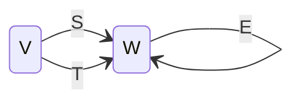

# Exercises from Axler 3.C

1, 2, 6, 9, 18, 21

## Question 1

Suppose $T\in\mathcal{L}(V, w)$ is invertible. Show that $T^{-1}$ is
invertible and $(T^{-1})^{-1} = T$.

### Answer

When asked to show that something has a certain property, it's often
best to go back to the definition of that property. A linear map
$R:V\to W$ is invertible (this is definition 3.59) if there exists an
$S:W\to V$ such that $RS$ is the identity on $W$ and $SR$ is the
identity on $V$.

So, in order to show that some linear map (say $T^{-1}$) is
invertible, we must exhibit another linear map with the required
properties.

The obvious candidate for an inverse of $T^{-1}$ is $T$. Let's check
whether it is. We need to check that $T^{-1}T$ is the identity on $V$
and that $TT^{-1}$ is the identity on $W$. And indeed they are --
because _those_ conditions are precisely the meaning of $T^{-1}$
(which we are assured exists by the question).

## Question 2

Suppose $T\in \mathcal{L}(U, V)$ and $S\in \mathcal{L}(V, W)$ are both
invertible. Prove that $ST$ is invertible and that $(ST)^{-1} =
T^{-1}S^{-1}$.

### Answer

To prove that something is invertible we must exhibit its
inverse. Fortunately, the question has told us what the inverse is, so
what we need to do is check that it does in fact satisfy the
conditions for being an inverse.

That is, we need to show: (1) that $\bigl(ST\bigr) \bigl(
T^{-1}S^{-1}\bigr)$ is the identity on $W$; and (2) that $\bigl(
T^{-1}S^{-1}\bigr) \bigl(ST\bigr)$ is the identity on $U$.

To show (1), note that composition of linear maps is associative --
that is, it doesn't matter where we put the parentheses. Thus, roughly
speaking, we can “cancel the inner $`T`$s” and then, having got rid of
those, “cancel the outer $`S`$s.”

More carefully, $\bigl(ST\bigr) \bigl( T^{-1}S^{-1}\bigr) = S(T
T^{-1})S^{-1}$ because composition is associative. And that is
$S\mathbf{1}_V S^{-1}$, which is $SS^{-1}$ which is
$\mathbf{1}_W$. The same argument works for (2).

## Question 6

Suppose that $W$ is finite-dimensional and $S, T\in\mathcal{L}(V,
W)$. Prove that $\text{null } S = \text{null } T$ if and only if there
exists an invertible $E\in\mathcal{L}(W)$ such that $S=ET$.



### Answer

The “if” direction is the most straighforward. First, if such an $E$
exists, then $\text{null }S \subset \text{null }T$. (To see this,
suppose $v\in\text{null }T$; that is, $T(v)=\mathbf{0}$. Since $S(v) =
E(T(v))$ we have $S(v)=E(\mathbf{0}) = \mathbf{0}$ and hence $v\in\text{null S}$.) Now
run the argument again, using $E^{-1}$ and conclude that $\text{null
}T\subset\text{null }S$. Putting those together implies $\text{null
}S=\text{null }T$.

The other direction is not so easy!

What is this question saying? It is sort of saying two things. The
first is something like, “if the null spaces of $S$ and $T$ are equal,
then their ranges are isomorphic.” That's kind of interesting, because
the null spaces live in the domain of $S$ and $T$, whereas the ranges
live in the codomain.

The second thing the question is saying is, “the ismorphism between
the ranges of $S$ and $T$ can be extended to an isomporphism on the
whole of $W$.” That is, “the bit of $W$ that isn't the range of $S$ is
also isomorphic to the bit of $W$ that isn't the range of $T$.” This
part is less interesting because it's nothing to do with maps like $S$
and $T$ (at least, I don't think so).

So, let's try to show that the range of $T$ is isomporphic to the
range of $S$. That is, we will show

```math
\text{null }S = \text{null }T \implies \text{range }S \cong
\text{range }T.
```

To do so, we will construct a linear map, $\tilde{E}\colon \text{range
}T\to\text{range }S$, that is both injective and surjective (and thus
invertible).

Roughly speaking, the $\tilde{E}$ that we are looking for is “$`\tilde{E}=S\circ
T^{-1}`$”. That is, given some element of $W$, we “take it back to $V$
with $T^{-1}$ and then forwards again to $W$ using $S$.”

How do we make this more precise? Suppose we have some $w\in W$ that
is in the range of $T$. There must be _some_ $v\in V$ such that $T(v)
= w$. We'd like to be able to define $\tilde{E}$ by

```math
\tilde{E}(w) = S(v).
```

The only problem is that there might be _another_ $v'\in V$ such that
$T(v') = w$. The rule above will only make sense if $S(v) = S(v')$ for
any such $v'$. Fortunately, that is true! Indeed, if $T(v')=T(v)$ then
$T(v'-v)=\mathbf{0}$; in other words, $v'-v$ is in the null space of
$T$. But by supposition this is the null space of $S$. So
$S(v'-v)=\mathbf{0}$ and therefore $S(v)=S(v')$.

So we have constructed $\tilde{E}$ on any element of $\text{range
T}$. It is “go back to $V$ using $T$ and then forward to $W$ using
$S$, noting that it doesn't matter which element of $V$ you use.”

To show that $\tilde{E}$ is an isomorphism, we need to show that it is
injective and surjective. It would fail to be injective if there were
$w,w'\in \text{range T}$, with $w\neq w'$, such that $\tilde{E}(w) =
\tilde{E}(w')$. But this would mean that $\tilde{E}(w-w')=\mathbf{0}$
and therefore (by the definition of $\tilde{E}$) that
$\S(v'-v)=\mathbf{0}$ for some $v$ and $v'$ with $T(v)=w$ and
$T(v')=w'$. But _that_ means (since the null spaces are equal) that
$T(v'-v)=\mathbf{0}$ and therefore $w=w'$. So $\tilde{E}$ cannot fail
to be injective.

It would fail to be injective if there were some $z\in \text{range }S$
that is not the image of any $w$ under $\tilde{E}$. But it's easy to
find the required $w$: starting from $z$, “go back to $V$ using $S$
and then forward to $W$ using $T$” following just the same argument above.

We have shown that $\text{range }S$ and $text{range T}$ are
isomorphic. But to finish the argument, we must show that $\tilde{E}$
has an extension to $W$. That is, we need to find an $E$ with
$E|_{\text{range }T}\tilde{E}$.

Since $\text{range }T$ is a subspace, there is another subspace, say
$X_1$, such that $W=\text{range }T\oplus X$. (This is Axler 2.33, and
relies upon $W$ being finite-dimensional.) That is, one can find a
subspace $X$ such that any vector in $w$ can be written uniquely as
the sum of a vector in $\text{range }T$ and a vector in $X$. Likewise,
we can find a subspace $Y$ such that $W=\text{range }S\oplus Y$. 

Now -- and this is not very satisying -- since $W$ is
finite-dimensional, and since $\text{range }S\cong \text{range }T$, we
must have $\text{dim }X = \text{dim }Y$. Thus $X$ and $Y$ are
isomorphic. So there is some invertible $\tilde{F}\colon X\to Y$. 

Now we get to say what $E$ is. For $w\in W$, write $w = \tilde{w}+x$
where $\tilde{w}\in\text{range }T$ and $x\in X$. Set

```math
E(w) = \tilde{E}(\tilde{w}) + \tilde{F}(x).
```

## Question 9

Suppose $V$ is finite-dimensional and $T\colon V\to W$ is a surjective
linear map of $V$ onto $W$. Prove that there is a subspace $U$ of $V$
such that $T\rvert_U$ is an isomorphism of $U$ onto $W$.

### Answer

Question 6 was about splitting up $W$ into “the range of $T$ plus
another bit.” This question is sort of the complement: we're splitting
$V$ into “the null space of $T$ plus another bit.”

So, let $(\vec{e}_1, \dots, \vec{e}_m, \vec{f}_1, \dots, \vec{f}_n)$ be
a basis of $V$ such that $(\vec{e}_1, \dots, \vec{e}_m)$ is a basis for
$\text{null }T$ and the $`\vec{f}`$s extend that to a basis of the
full space.

I claim that a subspace satisfying the conditions of the question is
$U = \text{span }(\vec{f}_1, \dots, \vec{f}_n)$. First of all, it _is_
a subspace (since it’s the span of some vectors). The map $T|_U$ is
also surjective. For, given some $\vec{w}\in W$, then, since the
original $T$ was surjective, there must be $\vec{v}\in V$ with
$T(\vec{v}) = \vec{w}$. Now write $\vec{v}=\vec{u}+\vec{\nu}$ where
the $\vec{u}$ is a combination of the $`\vec{f}`$s and the $\vec{\nu}$
is a combination of the $`\vec{e}`$s (ie, in the null space). Since
$T(\vec{\nu})=\mathbf{0}$ we must have $\vec{w} = T(\vec{v}) =
T(\vec{u}) = T|_U(\vec{u}$. And since $\vec{u}\in U$, we have shown
that $T|_U$ is surjective.

Then, suppose $\vec{v}_1,\vec{v}_2\in U$ are distinct; it follows that
$T|_U(\vec{v}_1) \neq T|_U(\vec{v}_2)$, otherwise their difference
would be in $\text{null }T$, and hence that $T|_U$ is injective.

Finally, since $T|_U$ is surjective and injective, it is an
isomorphism.

## Question 18

Show that $V$ and $\mathcal{L}(\mathbf{F}, V)$ are isomorphic vector
spaces.

### Answer

We must exhibit an invertible linear map between $V$ and
$\mathcal{L}(\mathbf{F}, V)$. 

What is $\mathcal{L}(\mathbf{F}, V)$? It is the space of linear maps
from $\mathbf{F}$ to $V$. That is, an element of
$\mathcal{L}(\mathbf{F}, V)$ is a rule which, given a number in
$\mathbf{F}$, produces a vector in $V$. Suppose
$\tilde{w}\in\mathcal{L}(\mathbf{F}, V)$ is one such rule. Then, for
any $\alpha\in\mathbf{F}$, $`\tilde{w}(\alpha) =
\tilde{w}(\alpha\times 1) = \alpha\tilde{w}(1)`$. In other words, any
$\tilde{w}\in\mathcal{L}(\mathbf{F}, V)$ is defined entirely by its
action on $1$. Indeed, $\tilde{w}(1)$ is an element of $V$, so we can
say that any element of $\mathcal{L}(\mathbf{F}, V)$ is defined by a
specific vector in $V$. That's the informal story.

More carefully, consider the map, $\Omega\colon
V\to\mathcal{L}(\mathbf{F}, V)$ which acts in the following way: for
any $\vec{v}\in V$, set $\Omega(\vec{v})$ to be the map

```math
\begin{aligned}
\Omega(\vec{v}) : \mathbf{F} &\to  V \\
\alpha &\mapsto \alpha \vec{v}.
\end{aligned}
```

That is to say, $\Omega(\vec{v})$ is an element of
$\mathcal{L}(\mathbf{F}, V)$, hence a map; specifically the map which
takes any $\alpha\in\mathbf{F}$ to the vector $\alpha\vec{v}$.

I claim the map $\Omega$ is both injective and surjective. Suppose
$\vec{v}, \vec{v}'\in V$ are distinct. Then clearly
$\Omega(\vec{v}) \neq \Omega(\vec{v}')$, since they take $1$ to
different vectors. That shows injectivity of $\Omega$.

Suppose $\tilde{w}\in \mathcal{L}(\mathbf{F}, V)$ is some map. Then
$\tilde{w}(1)$ is some element of $V$, and indeed $\Omega(\tilde{w}(1)) =
\tilde{w}$. That shows surjectivity of $\Omega$.

## Question 21

Suppose $n$ is a positive integer and $A_{jk}\in\mathbf{F}$ for
$j,k\in\{1,\dots,n\}$. Prove that the following are equivalent:

(a) The only solution to the homogeneous system of equations

```math
\sum_k A_{ik} x_k = 0 \quad (i\in\{1,\dots, n\})
```

is the trivial solution $x_1 = \dotsb = x_n = 0$.

(b) For every $c_1,\dots,c_n\in\mathbf{F}$, there exists a solution to
the system of equations

```math
\sum_k A_{ik} x_k = c_i \quad (i\in\{1,\dots, n\}).
```

### Answer

Consider the vector space $\mathbf{F}^n$ and let $A$ be the linear map
in $\mathcal{L}(\mathbf{F}^n, \mathbf{F}^n)$ whose matrix
representation in the canonical basis of $\mathbf{F}^n$ is
$A_{jk}$.

Then (a) is equivalent to the statement that $A$ is injective; and $b$
is equvalent to the statement that $A$ is surjective. But we know
(Axler 3.65) that, for linear maps between finite-dimensional vector
spaces of the same dimension, each of these properties implies the
other.
